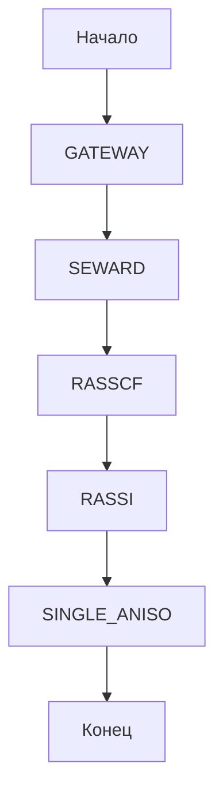

## FastMOLCAS
Удобные функции для составления input файлов и отчетов для OpenMolcas

OpenMolcas — это программный пакет для квантово-химических расчетов, который предоставляет пользователям инструменты для моделирования молекул и изучения их свойств. Он основан на методах многочастичной теории и включает в себя различные подходы, такие как теорию функционала плотности (DFT) и методы аб initio. OpenMolcas поддерживает широкий спектр расчетов, включая геометрическую оптимизацию, спектроскопию и анализ реакций. Пакет ориентирован на исследователей в области химии, физики и материаловедения и предлагает гибкость и расширяемость для решения сложных задач.

Структура проекта
fast_input - набор функций, которые, автоматически составляют входной файл для ab-initio расчета свойств мономолекулярных магнитов
convert - функция, для конвертации cif файла в xyz файл
fast_report - набор функций, который составляет отчет в папку master>docs

Структура проекта

```
└── 📁master
    └── 📁docs
    └── 📁inputs
    └── 📁logs
    └── 📁structures
─── fast_input.ipynb
─── fast_reprot.ipynb
─── convert.ipynb
```

